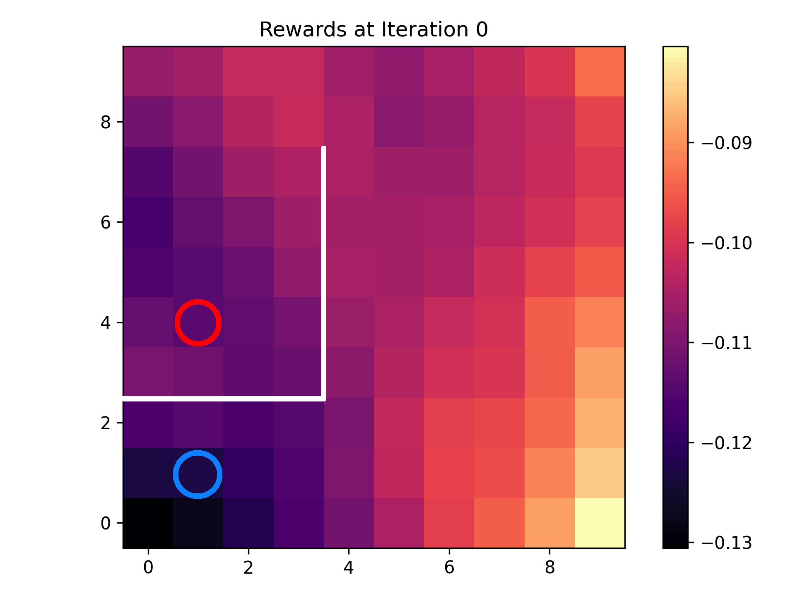

# Adversarial Intrinsic Motivation for Reinforcement Learning



This repository contains code to accompany the paper [Adversarial Intrinsic Motivation for Reinforcement Learning](https://arxiv.org/abs/2105.13345),
published at the Thirty-fifth Conference on Neural Information Processing Systems (NeurIPS 2021).

This repo contains the code to run the simple grid world examples,
as well as the experiments on the Fetch domain.

## Requirements

A lot of the code, such as the `TD3` implementation and the execution setup is taken from
the [stable-baselines repository](https://github.com/hill-a/stable-baselines) and the accompanying
[RL Baselines zoo repository](https://github.com/araffin/rl-baselines-zoo).

You will not need to install these repositories, but the dependencies are similar to those libraries.
These requirements can be satisfied as follows:

```
pip install -r requirements.txt
```

## Examples

A single run on the `FetchReach-v1` domain can be executed by running the following command:
```
python -u train.py --algo her --env FetchReach-v1 --tensorboard-log $PathToTensorboardLogs --eval-episodes 100 --eval-freq 2000 -f $PathToResultsFile --seed $SEED
```
